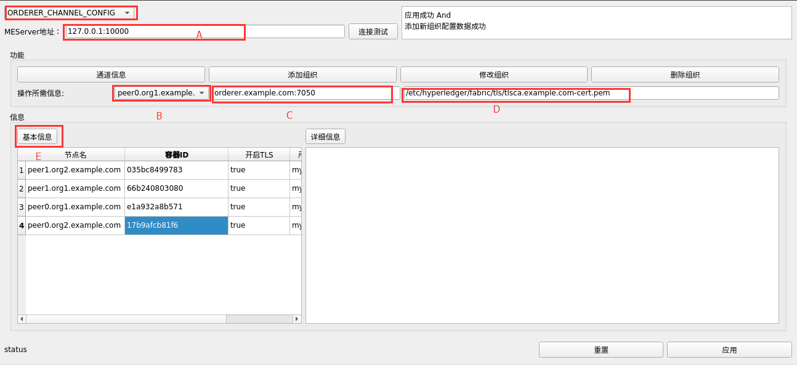
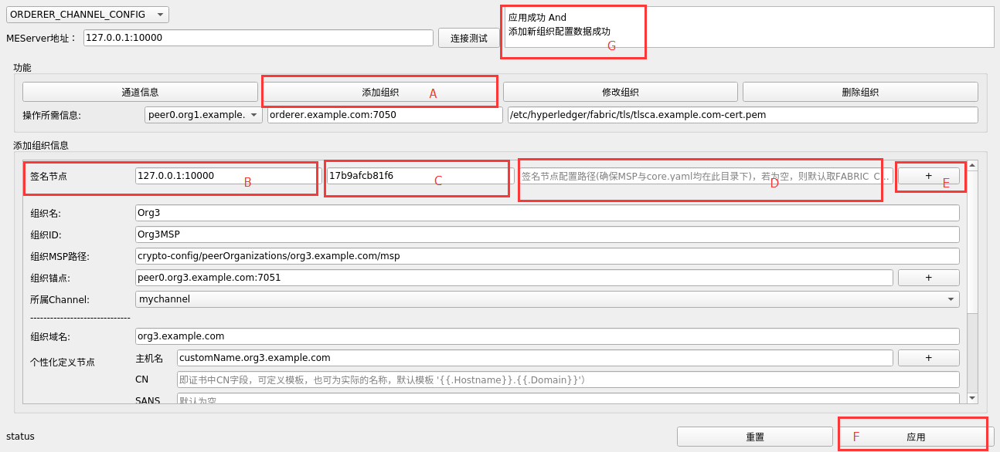

## 概述

针对区块链项目hyperledger-fabric项目节点配置比较麻烦而编写的项目：ME -> More Easy。分为客户端程序meclient和服务器端程序meserver。meserver运行在fabric节点物理机中，meclient运行在任何一个可以与节点通信的物理机中。meclient提供配置数据和配置命令，meserver在fabric部署节点中通过操作容器执行相应配置数据和命令。

## 配置内容：

orderer自身配置

peer自身配置

通道配置

策略配置

kafka配置

## 编译

#### 客户端

##### 环境

因为客户端是使用`github.com/therecipe/qt`编写，因此需要使用该库提供的编译程序进行编译。请浏览该库并根据自身编译系统选择安装qtdeploy等程序。安装之后，即可执行编译工作。

编译命令：在fabric-meconfig目录下，执行`qtdeploy -docker --tags nopkcs11`。 --tags nopkcs11是因为调用的有fabric中的源码，会涉及到一个github.com\miekg\pkcs11\pkcs11.go出现的fatal error:ltdl.h: No such file or directory错误，因为在编译的时候需要libltdl-dev这个库，但是qtdeploy的编译容器里面默认没用安装这个库。

#### 服务端

服务端是标准的go程序，因此直接在fabric-meconfig/common/meserver目录下，执行`go build --tags nopkcs11`即可。`--tags nopkcs11`也是因为fatal error:ltdl.h: No such file or directory错误，但是若编译的系统中安装了libltdl-dev，不加此tags亦可。

## 执行

1.	打开meclient文件夹，执行fabric-meconfig.sh脚本，运行meclient，即客户端界面程序。客户端程序的日志会记录在同文件夹的gui.log目录中
2.	（在部署的区块链节点上）打开meserver文件夹，sudo ./meserver，即管理员权限执行meserver服务端程序。meserver的日志会记录在同文件夹的server.log中

## 用例

比如增加一个新组织，操作如下：

1.	A处：选择meserver所在的物理机地址（这里默认值是127.0.0.1，即meserver与meclient在同一台物理机上）
2.	B处：选择最终进行执行peer channel update进行添加新组织的节点容器
3.	C处：Orderer节点地址
4.	D处：B处选择节点所持有（该节点必须持有）的连接Orderer节点的TLS CA证书路径。
5.	E处：可以获取meserver所在的节点上运行的peer节点容器的基本信息（若是物理机部署，则暂未实现）

1.	A处：点击进去组织添加组织面板
2.	B处：输入签名节点的meserver的监听地址（127.0.0.1:10000依然说明meclient和meserver运行在同一台物理机上）
3.	C处：签名节点执行签名的容器ID（该容器必须持有管理员角色MSP，因为添加组织的通道的修改策略默认是MAJORITY）
4.	D处：签名节点的配置路径，若未自定义，则为空即可，程序自动获取签名节点FABRIC_CFG_PATH的环境变量值作为配置路径，该路径下必须包含签名节点的msp，tls和core.yaml（默认亦都在FABRIC_CFG_PATH此目录下）。
5.	E处：点击可以增加一个签名节点的信息。同样，通道修改策略默认是MAJORITY，当需要更多的管理员节点签名时，点击此处增加。
6.	填写要添加的组织的信息。
7.	F处：填写完毕后，点击应用。
8.	G处：若添加成功，则显示如图信息。

## 限制：

服务端若是docker容器部署的节点，则容器需要满足以下前提，程序才能成功执行：

* orderer容器中包含orderer关键词，且非orderer容器不包含orderer关键词，peer节点容器名中需要包含peer关键字。
* 服务端需以管理员权限运行。
* 区块链节点以物理机的方式部署的操作暂未实现。
* 目前支持hyperleder-fabric v1.0版本。

